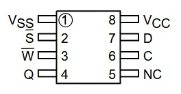
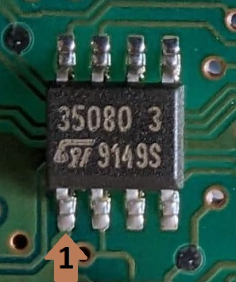
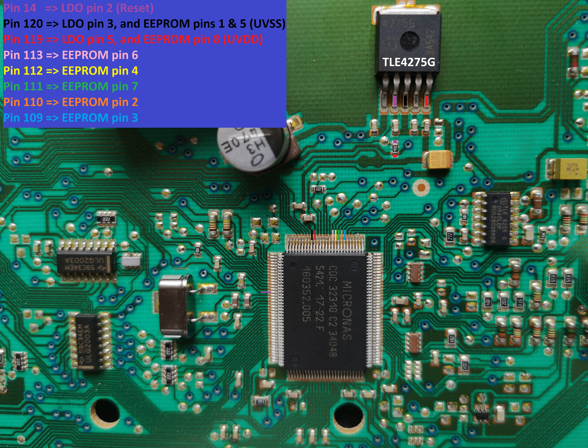

# Overview

This repository contains an Arduino sketch and documentation to read and potentially modify data stored in the **M35080 EEPROM** found in some Opel vehicles.
This M35080 EEPROM it's present in the Instrument Panel Cluster (IPC) and stores critical vehicle information such as the kilometrage (mileage), VIN (Vehicle Identification Number), and the vehicle pin/security code...

## Pinout and Diagrams

### 1. Micronas CDC3231G Pinout

JTAG Pinout

| Pin No. | Description |
| ---     | ---         |
| 14      | RESET       |
| 114     | TDO         |
| 115     | TCK         |
| 116     | TMS         |
| 117     | TDI         |
| 118     | TEST2       |

### 2. M35080 Pinout

### 3. M35080 Pin #1

### 4. Instrument Panel Cluster

